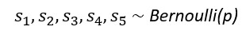
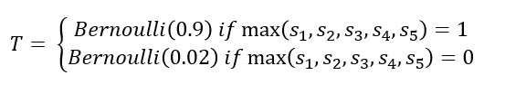

# Covid Tests Simulation

## Introduction  

At the beginning of the COVID epidemic, viral tests were in short supply (shortage of collection kits (i.e. nasal swabs), shortage of staff to analyze collected samples, etc.) In May 2020, The New York Times published an article [*Five People. One Test. This is how you get there*](https://www.nytimes.com/2020/05/07/opinion/coronavirus-group-testing.html) that describes a method experimented in Nebraska where **group testing is used : samples from 5 people are pooled and one test is used. If the test comes back negative, you can clear all those people with one test. If it comes back positive, you retest the people’s samples individually.** 

One thing to note is that this method works because **diluted samples are still usable**. Intuitively, this method should work when the proportion of the population infected is small. And when that proportion is big, it should result in more tests. 

**So does this method really result in fewer tests ? And if so, to what proportion of the infected population does this method still work?** 

## Method of resolution 

To answer the questions above, what we really need to know is : **On average, how many tests does it take to test a single person conclusively ?**

There are sources of randomness that might lead this number to be different each time: 
1) **Whether the patient of interest has COVID** 
- This depends on how much of the population is infected with COVID 
- We’ll denote this variable s1; equal to 1 if the patient has COVID, and 0 otherwise
2) **Whether the other four patients being tested have COVID**
- We’ll denote these variables s2, s3, s4, s5; each variable will be 1 if the relevant patient has COVID, and 0 otherwise
3) **Whether the combined sample tests are positive or negative** 
- This depends on the sensitivity and specificity of the test and on whether anyone in the sample is tested
- We’ll denote this T, equal to 1 if the test is positive, and 0 otherwise

We set the following values : 
- **Sensitivity** (TPR : Probability someone tests positive if they do have the condition) = 0.9 
- **Specificity** (TNR : Probability someone tests negative if they do not have the condition) = 0.98 

- The s variables depend on the proportion p of the population currently infected with COVID : 

- The T variable depends on whether the sample had any COVID-positive samples :

Based on the above, the outcome is : 
- **If T=0, we don't need to carry out any further test** : the number of tests required for our person of interest is **0.2** 
- **If T=1, we need to re-test every one of the five people in the sample** : number of tests per peson is **1.2**

Let's conduct **Monte Carlo simulations** to take into account this randomness 

## Results 

We run 1,000 simulations for each value of p (proportion infected) and p ranges from 0 to 100%. Everytime, we record the **average number of tests required** as well as the **standard deviation**. We then plot the following graph, showing the confidence interval for each value: 

**We can thus confirm that for a low proportion of population infected (<0.4), it is worth using grouped testing as the average test needed per person is inferior to 1. However, when the proportion goes above 0.4, the method is not efficient anymore and testing each person individually becomes necessary (or reducing the number of people in the pool)** 
